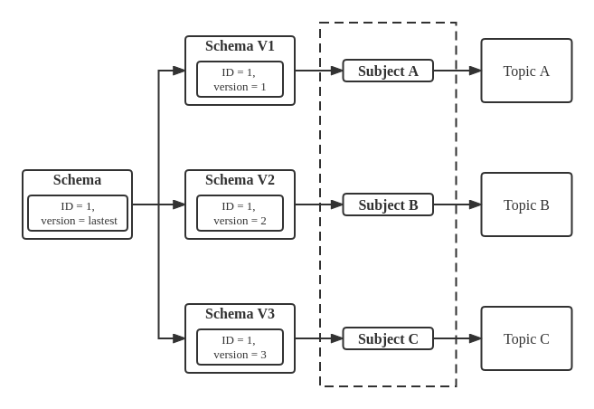

RocketMQ Schema Registry
================

RocketMQ Schema Registry is a Topic Schema's management center. It provides a RESTful interface for register,
delete, update, get and reference schema to subject(RocketMQ Topic). By associating Schema with subject, the New 
RocketMQ client can send structured data directly. User no longer need to care about the details of serialization
and deserialization.

Schema struct can change, it will generate a new version number with each update. During schema evolution, the 
service needs to verify that changes comply with user-specified compatibility configuration. And each Schema Record
in the evolution can be individually referenced to other subject.

It offers a variety of features:

* Handle basic schema management operation including store, query, update, delete
* Encoding / Decoding capacity by user specified serializer / deserializer in client
* Compatibility validate in duration of schema evolution or send/receive message
* Create reference between schema version and a new subject
* Currently, only the Avro type is supported. Json, PB, and Thrift types will be extended later

Getting started
--------------

#### Prepare storage layer

Currently, Schema registry only supports RocketMQ storage, and relies on the Compact Topic feature of RocketMQ-5.0.
Previous RocketMQ versions can also be worked, but there are some risk of data loss if the machine disk fails. 
DB-type storage layers will be extended in the future.

You can use the existing RocketMQ service or start a new one.

```shell
# Download release from the Apache mirror
$ wget https://archive.apache.org/dist/rocketmq/4.9.3/rocketmq-all-4.9.3-bin-release.zip

# Unpack the release
$ unzip rocketmq-all-4.9.3-bin-release.zip

# Prepare a terminal and change to the extracted `bin` directory:
$ cd rocketmq-4.9.3/bin

# Start namesrv & broker
$ nohup sh mqnamesrv &
$ nohup sh mqbroker -n localhost:9876 &
```

#### Install & Running locally

```shell
$ git clone git@github.com:apache/rocketmq-schema-registry.git
$ cd rocketmq-schema-registry
$ mvn clean package
```

Take the build JAR in core/target/ and run `java -jar rocketmq-schema-registry-core-0.0.3-SNAPSHOT.jar` to start service.

Then REST API can be accessed from http://localhost:8080/schema-registry/v1

Swagger API documentation can be accessed from http://localhost:8080/swagger-ui/index.html

#### Customized configurations (Optional)

##### Local cache

```shell
$ echo "storage.local.cache.path=${dir}" >> storage-rocketmq/src/main/resources/rocketmq.properties
```

##### Package management

If you want to upload binary resources to your package repository like artifactory, schema-registry
support `schema.dependency.upload-enabled = true` to enable package management.

Properties details:

| Property                                | Description                                                                |
|-----------------------------------------|----------------------------------------------------------------------------|
| schema.dependency.jdk-path              | The JDK used when compiling Java files                                     |
| schema.dependency.compile-path          | The root directory used when compiling Java files                          |
| schema.dependency.local-repository-path | The local cache directory for the Jar package                              |
| schema.dependency.repository-url        | The remote repository access url, multiple repository cannot be configured |
| schema.dependency.username              | The remote repository access username                                      |
| schema.dependency.password              | The remote repository access password                                      |

**Notice: Please make sure your account has permission to upload to the remote repository.**

API Reference
--------------

```shell

# Register new schema on specified subject with default cluster and tenant
$ curl -X POST -H "Content-Type: application/json" \
-d '{"schemaIdl":"{\"type\":\"record\",\"name\":\"SchemaName\",\"namespace\":\"rocketmq.schema.example\",\"fields\":[{\"name\":\"name\",\"type\":\"string\"}]}"}' \
http://localhost:8080/schema-registry/v1/subject/RMQTopic/schema/SchemaName

# Register new schema with cluster specified cluster and tenant
$ curl -X POST -H "Content-Type: application/json" \
-d '{"schema": "{\"type\": \"string\"}"}' \
http://localhost:8080/schema-registry/v1/cluster/default/tenant/default/subject/RMQTopic2/schema/Text

# Delete schema all version
$ curl -X DELETE http://localhost:8080/schema-registry/v1/cluster/{cluster-name}/tenant/{tenant-name}/subject/{subject-name}/schema

# Update schema and generate a new version, you can also use default cluster and tenant like register interface
$ curl -X PUT -H "Content-Type: application/json" \
-d '{"schemaIdl":"{\"type\":\"record\",\"name\":\"SchemaName\",\"namespace\":\"rocketmq.schema.example\",\"fields\":[{\"name\":\"name\",\"type\":\"string\"},{\"name\":\"id\",\"type\":\"string\",\"default\":\"0\"}]}"}' \
http://localhost:8080/schema-registry/v1/subject/RMQTopic/schema/SchemaName

# Get binding schema version by subject with specified cluster and tenant, , you can also use default cluster and tenant like register interface
$ curl -X GET http://localhost:8080/schema-registry/v1/subject/RMQTopic/schema

# Get schema record by specified version
$ curl -X GET http://localhost:8080/schema-registry/v1/cluster/{cluster-name}/tenant/{tenant-name}/subject/{subject-name}/schema/versions/{version}

# Get all schema record
$ curl -X GET http://localhost:8080/schema-registry/v1/cluster/{cluster-name}/tenant/{tenant-name}/subject/{subject-name}/schema/versions
```

Compatibility
--------------
Default compatibility is BACKWARD, which means that each change of Schema has no impact on the running programs. 
Transitivity specifies the compatibility check scope for each change.

| Compatible strategy | Permitted changes                 | Transitivity          | Upgrade order |
|---------------------|-----------------------------------|-----------------------|---------------|
| BACKWARD            | Delete fields Add optional fields | Last version          | Consumers     |
| BACKWARD_TRANSITIVE | Delete fields Add optional fields | All previous versions | Consumers     |
| FORWARD             | Add fields Delete optional fields | Last version          | Producers     |
| FORWARD_TRANSITIVE  | Add fields Delete optional fields | All previous versions | Producers     |
| FULL                | Modify optional fields            | Last version          | Any order     |
| FULL_TRANSITIVE     | Modify optional fields            | All previous versions | Any order     |
| NONE                | All changes are accepted          | Disabled              | Depends       |

Architecture
--------------

Once Schema Registry enabled, the process for publishing and subscribing will become to:
1. During the sending message, the Schema will be parsed and be checked whether it comply with the Topic Schema
compatibility. If it passes, producer will serialize data and prefix it with an SchemaId. If the verification fails,
the send request will be rejected;
2. The consumer will deserialize message with SchemaId. And what user sees is always structured data similar to
`public class User {  String name;  int id;  }`


To reduce the coupling between Schema Registry and RocketMQ, Concept "Subject" were introduced to represent which combination of RocketMQ Topic and Schema.



Contribute
--------------

We always welcome new contributions, whether for trivial
cleanups, [big new features](https://github.com/apache/rocketmq/wiki/RocketMQ-Improvement-Proposal) or other material
rewards, more details see [here](http://rocketmq.apache.org/docs/how-to-contribute/).

License
----------
[Apache License, Version 2.0](http://www.apache.org/licenses/LICENSE-2.0.html) Copyright (C) Apache Software Foundation
